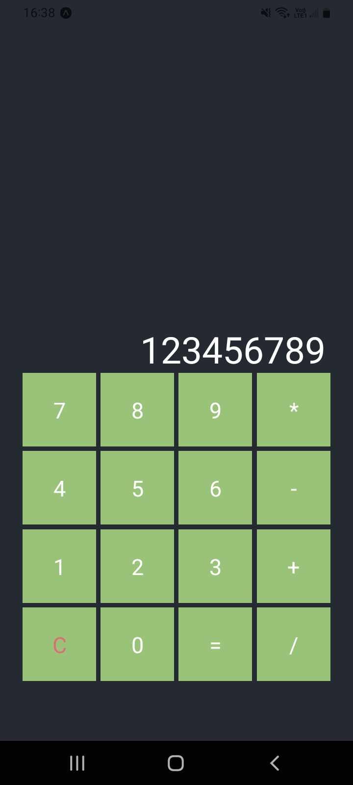
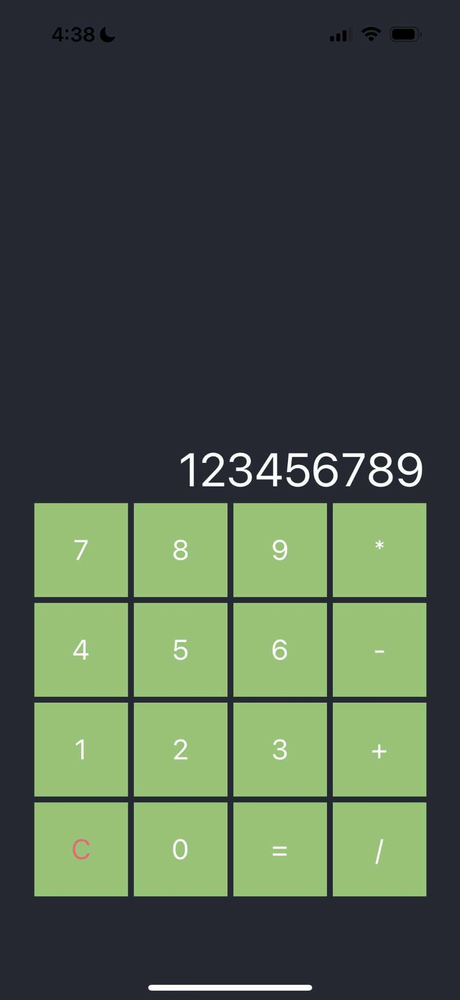

# react-native-calculator

A calculator app for practicing React Native

## Install

- Android: Install apk file from [Release](https://github.com/ascodeasice/react-native-calculator/releases) page
- IOS: follow the development instruction and build from source

## Development

1. clone the project
2. Run `yarn install --dev`
3. Run `yarn start` to start Expo
4. Scan the QR code with app ([Documentation](https://reactnative.dev/docs/environment-setup))

> Install the Expo Go app on your iOS or Android phone and connect to the same wireless network as your computer. On Android, use the Expo Go app to scan the QR code from your terminal to open your project. On iOS, use the built-in QR code scanner of the default iOS Camera app.

## Screenshots

Android

IOS

